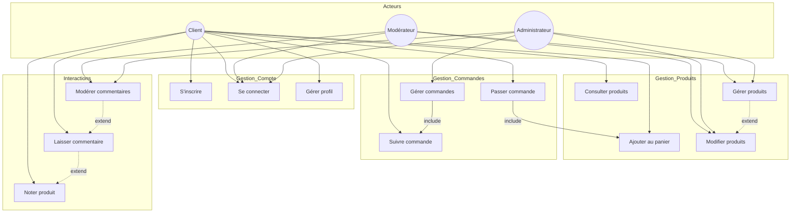
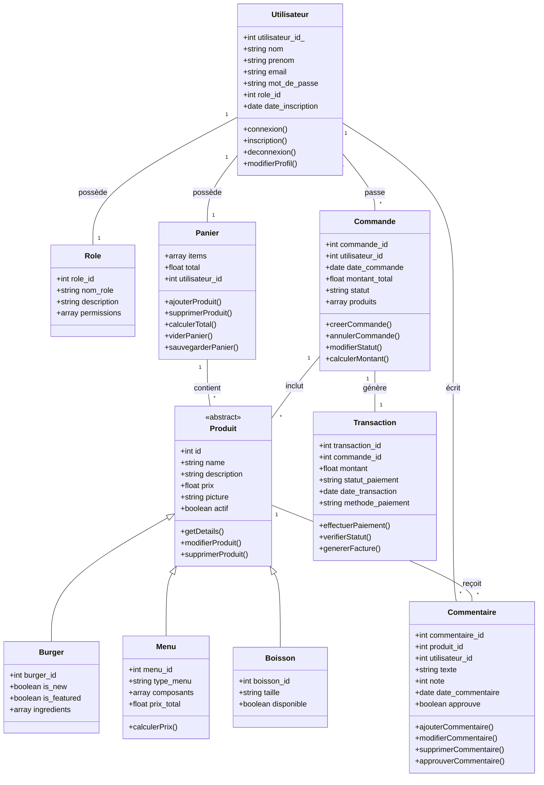
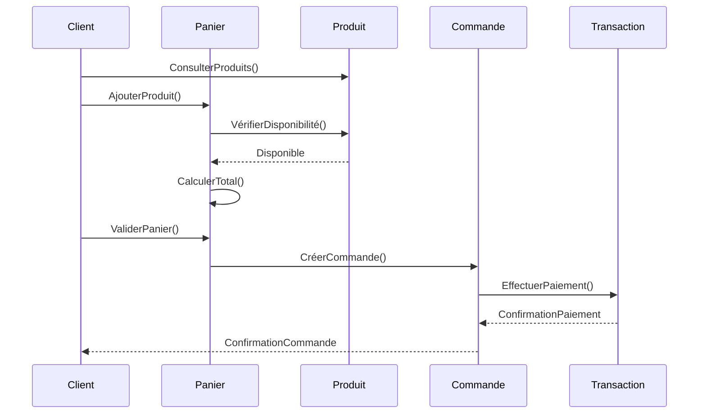

# Documentation du Site PhantomBurger

## Introduction
PhantomBurger est une plateforme en ligne dédiée à la vente de produits alimentaires, principalement des burgers, boissons, et menus. Le site offre une expérience utilisateur fluide avec des fonctionnalités de gestion de compte, de panier, et de commentaires.

## Diagrammes UML

### Diagramme de Cas d'Utilisation

### Diagramme de Classes

### Diagramme de Séquence - Processus de Commande

## Langages et Technologies Utilisés

- **HTML/CSS** : Pour la structure et le style des pages web.
- **PHP** : Pour la logique côté serveur et la gestion des sessions.
- **JavaScript** : Pour les interactions dynamiques et la manipulation du DOM.
- **MySQL** : Base de données pour stocker les informations des utilisateurs, produits, et commentaires.

## Fonctionnalités Principales

- **Page d'accueil** : Présente les produits phares et les offres spéciales.
- **Catalogue de Produits** : Affiche les produits par catégorie (menus, boissons, burgers).
- **Système de Connexion/Inscription** : Permet aux utilisateurs de créer un compte, se connecter, et gérer leur profil.
- **Panier d'Achat** : Les utilisateurs peuvent ajouter des produits à leur panier et procéder à l'achat.
- **Commentaires et Évaluations** : Les utilisateurs peuvent laisser des commentaires et des notes sur les produits.
- **Page de Contact** : Informations de contact et formulaire pour joindre l'équipe.
- **Page À Propos** : Présente l'histoire et les engagements de PhantomBurger.

## Structure du Projet

- **pages/** : Contient les différentes pages du site (index, produits, contact, etc.).
- **header/** et **footer/** : Composants réutilisables pour l'en-tête et le pied de page.
- **styles/** : Fichiers CSS pour le style global du site.
- **scripts/** : Scripts PHP pour la gestion des formulaires et la connexion à la base de données.
- **assets/** : Images et autres ressources statiques.
- **database/** : Scripts de gestion de la base de données.

## Installation et Configuration

1. Cloner le dépôt du projet.
2. Configurer la base de données MySQL avec les scripts fournis dans le dossier `database/`.
3. Configurer les paramètres de connexion à la base de données dans `scripts/conn.php`.
4. Lancer un serveur local pour tester le site.

## Documentation des Fonctions

### 1. `getProducts($pdo, $category)`
- **Description** : Récupère les produits de la base de données en fonction de la catégorie spécifiée.
- **Paramètres** :
  - `$pdo` : Instance de la connexion PDO à la base de données.
  - `$category` : Catégorie des produits à récupérer (e.g., 'menus', 'boissons', 'burgers').
- **Retourne** : Un tableau associatif contenant les produits.

### 2. `getProductByName($conn, $name)`
- **Description** : Récupère un produit de la base de données par son nom.
- **Paramètres** :
  - `$conn` : Instance de la connexion à la base de données.
  - `$name` : Nom du produit à rechercher.
- **Retourne** : Un tableau associatif contenant les détails du produit.

### 3. `validatePassword($password)`
- **Description** : Valide un mot de passe selon des critères de sécurité.
- **Paramètres** :
  - `$password` : Le mot de passe à valider.
- **Retourne** : `true` si le mot de passe est valide, sinon un message d'erreur.

### 4. `getUsers($pdo)`
- **Description** : Récupère la liste des utilisateurs de la base de données.
- **Paramètres** :
  - `$pdo` : Instance de la connexion PDO à la base de données.
- **Retourne** : Un tableau associatif contenant les utilisateurs.

### 5. `openEditProductForm(id, type, name, description, prix, picture)`
- **Description** : Ouvre le formulaire d'édition de produit avec les informations pré-remplies.
- **Paramètres** :
  - `id` : Identifiant du produit.
  - `type` : Type du produit (e.g., 'menu', 'boisson', 'burger').
  - `name` : Nom du produit.
  - `description` : Description du produit.
  - `prix` : Prix du produit.
  - `picture` : Image du produit.

### 6. `closeEditProductForm()`
- **Description** : Ferme le formulaire d'édition de produit.

### 7. `toggleMenuOptions()`
- **Description** : Affiche ou masque les options de menu en fonction du type de produit sélectionné. 

